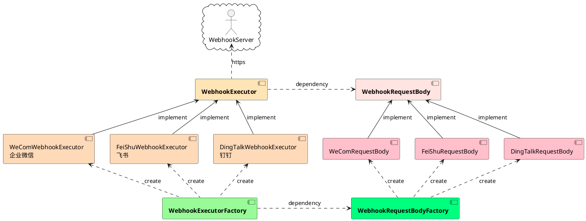

# woodwhales-common-webhook

通用 webhook 工具

## 常用通讯产品接口文档

|  产品   | 接口文档  |
|  ----  | ----  |
|  企业微信  | https://work.weixin.qq.com/api/doc/90000/90136/91770  |
| 钉钉  | https://developers.dingtalk.com/document/robots/custom-robot-access |
| 飞书  | https://open.feishu.cn/document/ukTMukTMukTM/ucTM5YjL3ETO24yNxkjN |

## 架构设计

### 核心组件

WebhookRequestBody 数据请求对象

WebhookExecutor 请求执行器

WebhookExecutorFactory 请求执行器工厂

WebhookRequestBodyFactory 数据请求对象工厂

### 组件关系图


## 代码示例

### spring-boot 项目使用示例

> 具体使用示例参见：
>
> [src/main/java/cn/woodwhales/webhook/config/ApplicationEventConfig.java](https://github.com/woodwhales/woodwhales-common-webhook/blob/main/woodwhales-common-webhook-web/src/main/java/cn/woodwhales/webhook/config/ApplicationEventConfig.java)
>
> [src/main/java/cn/woodwhales/webhook/web/IndexController.java](https://github.com/woodwhales/woodwhales-common-webhook/blob/main/woodwhales-common-webhook-web/src/main/java/cn/woodwhales/webhook/web/IndexController.java)

步骤1：监听 cn.woodwhales.webhook.event.WebhookEvent 事件，并注入通知地址。

```java
@Log4j2
@Configuration
public class ApplicationEventConfig {

    @Value("${notice.url}")
    private String noticeUrl;

    private String basePackageName = "cn.woodwhales.webhook";

    @Bean
    public WebhookExtraInfo webhookExtraInfo() {
        return new WebhookExtraInfo(5, TimeUnit.MINUTES);
    }

    @EventListener
    public void handleCustomEvent(WebhookEvent webhookEvent) {
        WebhookEventHandler.handleCustomEvent(webhookEvent, noticeUrl, basePackageName, webhookExtraInfo());
    }

}
```

步骤2：在业务代码中发布 WebhookEvent 事件即可。

```java
@RestController
@RequestMapping("test")
public class IndexController {

    @Autowired
    private ApplicationEventPublisher applicationEventPublisher;

    private RuntimeException exception = new RuntimeException("报错啦");

    /**
     *
     * @param content
     * @return
     */
    @GetMapping("/send")
    public String send(@RequestParam("content") String content) {

        // 方式1 显示创建指定webhook事件对象
        example1(content);

        // 方式1 不用显示创建指定webhook事件对象，根据通知发送链接自动识别创建对应的webhook事件对象
        example2(content);

        return "ok";
    }

    private void example1(String content) {
        WebhookEvent webhookEvent = WebhookEventFactory.feiShu(this, "测试标题", exception, request -> {
            request.addContent("content：", content);
            request.addContent("key：", content);
        });
        applicationEventPublisher.publishEvent(webhookEvent);
    }

    private void example2(String content) {
        WebhookEvent webhookEvent = WebhookEventFactory.newWebhookEvent(this, "测试标题", exception, request -> {
            request.addContent("content：", content);
            request.addContent("key：", content);
        });
        applicationEventPublisher.publishEvent(webhookEvent);
    }

}
```

### 非 spring-boot 项目使用示例

> 具体使用示例参见：[src/test/java/cn/woodwhales/webhook/executor/WebhookExecutorTest.java](https://github.com/woodwhales/woodwhales-common-webhook/blob/main/woodwhales-common-webhook-commons/src/test/java/cn/woodwhales/webhook/executor/WebhookExecutorTest.java)

方式1：

```java
@Test
public void DingTalkExecutor() {
    String url = "https://oapi.dingtalk.com/robot/send?access_token=zzz";

    BaseWebhookRequestBody requestBody = WebhookRequestBodyFactory.newInstance(WebhookProductEnum.DING_TALK, "test title");
    requestBody.addContent("key1：", "value1");
    requestBody.addContent("key2：", "value2");
    requestBody.addContent("key3：", "value3");

    GlobalInfo globalInfo = new GlobalInfo(new NullPointerException("报错啦"), "cn.woodwhales.webhook");
    requestBody.addGlobalInfo(globalInfo);

    WebhookExecutorFactory.execute(url, requestBody);
}
```

方式2：

```java
@Test
public void WeComExecutor() {
    String url = "https://qyapi.weixin.qq.com/cgi-bin/webhook/send?key=yyy";

    WebhookExecutorFactory.execute(WebhookProductEnum.WE_COM, url, "test title", req -> {
        req.addContent("key1：", "value1");
        req.addContent("key2：", "value2");
        req.addContent("key3：", "value3");
        GlobalInfo globalInfo = new GlobalInfo(new NullPointerException("报错啦"), "cn.woodwhales.webhook");
        req.addGlobalInfo(globalInfo);
    });
}
```

## 附件

### 组件关系图 plantUml 源码


