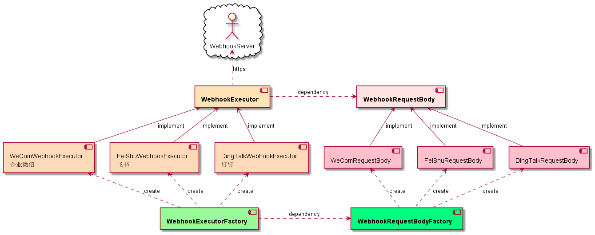
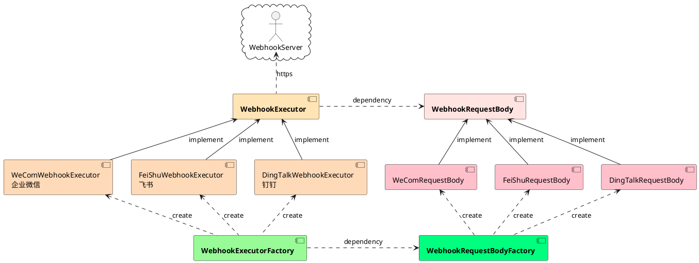

# woodwhales-common-webhook

通用 webhook 工具

## 常用通讯产品接口文档

|  产品   | 接口文档  |
|  ----  | ----  |
|  企业微信  | https://work.weixin.qq.com/api/doc/90000/90136/91770  |
| 钉钉  | https://developers.dingtalk.com/document/app/custom-robot-access |
| 飞书  | https://open.feishu.cn/document/ukTMukTMukTM/ucTM5YjL3ETO24yNxkjN |

## 架构设计

### 核心组件

WebhookRequestBody 数据请求对象

WebhookExecutor 请求执行器

WebhookExecutorFactory 请求执行器工厂

WebhookRequestBodyFactory 数据请求对象工厂

### 组件关系图



plantUml



## 代码示例

> 具体使用示例参见：[src/test/java/cn/woodwhales/webhook/executor/WebhookExecutorTest.java](https://github.com/woodwhales/woodwhales-common-webhook/blob/main/woodwhales-common-webhook-commons/src/test/java/cn/woodwhales/webhook/executor/WebhookExecutorTest.java)

方式1：

```java
@Test
public void DingTalkExecutor() {
    String url = "https://oapi.dingtalk.com/robot/send?access_token=zzz";

    BaseWebhookRequestBody requestBody = WebhookRequestBodyFactory.newInstance(WebhookProductEnum.DING_TALK, "test title");
    requestBody.addContent("key1：", "value1");
    requestBody.addContent("key2：", "value2");
    requestBody.addContent("key3：", "value3");

    GlobalInfo globalInfo = new GlobalInfo(new NullPointerException("报错啦"), "cn.woodwhales.webhook");
    requestBody.addGlobalInfo(globalInfo);

    WebhookExecutorFactory.execute(url, requestBody);
}
```

方式2：

```java
@Test
public void WeComExecutor() {
    String url = "https://qyapi.weixin.qq.com/cgi-bin/webhook/send?key=yyy";

    WebhookExecutorFactory.execute(WebhookProductEnum.WE_COM, url, "test title", req -> {
        req.addContent("key1：", "value1");
        req.addContent("key2：", "value2");
        req.addContent("key3：", "value3");
        GlobalInfo globalInfo = new GlobalInfo(new NullPointerException("报错啦"), "cn.woodwhales.webhook");
        req.addGlobalInfo(globalInfo);
    });
}
```

