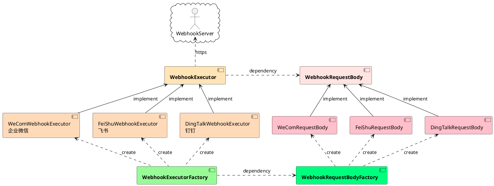

# woodwhales-common-webhook

> 🚀 本项目已迁移至：https://github.com/woodwhales/woodwhales-common/tree/master/src/main/java/cn/woodwhales/common/webhook，
>
> **请移步至：https://github.com/woodwhales/woodwhales-common 获取更多业务处理工具。**
>
> woodwhales-common 版本 >= 3.6.5 均支持本产品功能
>
> ```xml
> <dependency>
>  <groupId>cn.woodwhales.common</groupId>
>  <artifactId>woodwhales-common</artifactId>
>  <version>3.6.5</version>
> </dependency>
> ```

## 常用通讯产品接口文档

|  产品   | 接口文档  |
|  ----  | ----  |
|  企业微信  | https://work.weixin.qq.com/api/doc/90000/90136/91770  |
| 钉钉  | https://developers.dingtalk.com/document/robots/custom-robot-access |
| 飞书  | https://open.feishu.cn/document/ukTMukTMukTM/ucTM5YjL3ETO24yNxkjN |

## 架构设计

### 核心组件

WebhookRequestBody 数据请求对象

WebhookExecutor 请求执行器

WebhookExecutorFactory 请求执行器工厂

WebhookRequestBodyFactory 数据请求对象工厂

### 组件关系图


## 代码示例

参见：https://github.com/woodwhales/woodwhales-common/tree/master/src/main/java/cn/woodwhales/common/example/webhook

## 附件

### 组件关系图 plantUml 源码


